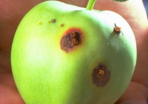
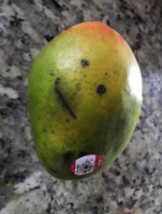
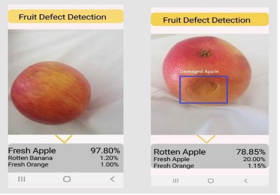

**GROUP 1**

**Ashutosh Tripathi**

**Abhay Tyagi**

**Manohar Rajawat**

## **Fruit Defect Detection System**

### **GOAL: To detect defects in Fruits using Deep Learning Algorithm**
### 1.1 **Input**: This Proposal will take some defective fruit images caused because of Insects, Bruises, Diseases as train and test data for input.

**Example**:

1.1.1 **Constraints**:
- The resolution of the camera should be at least 720p.
- The camera must be either held by the user or held by a sling
- Image can be taken from in front to minimize any reflection of light.
- Lighting conditions would also reduce the accuracy of the application unless trained or resolved.
1.1.2. **Operating Conditions:**
- This proposal focused on identifying the defects in fruits currently focusing on these fruits [ Oranges, Banana, Apples, Mangoes, Papaya, Peach].
- While detecting the defect on fruit the fruit should be in a close range of about  2-3 ft from the camera.
1.1.3. **DataSet:**
- The Dataset is collected from some images taken by the camera of the fruits and some through Kaggle.com to train the Model.
- Images are taken from a variety of different angles, poses, and distances.
- Dataset is divided into various types of defects [ Insects, Bruises, Diseases].
### 1.2. **OUTPUT:** Example:

### 2. **Development Platform and Target AVD and Device tested       on**
- **Target AVD** - This project would be using OpenCV version 4.1 on Emulator at API 27 on Android 8.
- **Testing Device** - The final testing of the application will be done using Samsung Galaxy A8 Star with Android Version 10(One UI version 2).
### 3. **Overview:**

**Following are the System Components:**

- Image Pre-Processing
- Defect Detection
- Classification of Defect

3.1. **Image Pre-Processing:**
- This proposal is going to use the Median Filtering to remove the noise from the images and maintain the edge properties.
- It will also zoom in and apply other data augmentation technique like:
- Horizontal Flip
- Zoom
- Rotation of the images

3.2. **CNN**
- The processed images are put to the CNN as input.
- There will be minimum three layer of convolution and max pooling
- Using the Keras  Sequential class and Dense for AI neural network .
- The output class will identify the defect on the fruit and the type of the defect.

3.3 **Results**
- The App will display the labeled images with classified fruit defect such as :
- Damaged
- Rotten
- Insect
- Diseased

## 4. **GUI [Graphical User Interface]**
- Initial interface that provides a button to start the application and capture an image of the fruit.
- The result interface will show that fruit defect classification along with the label that shows the type of detect.

